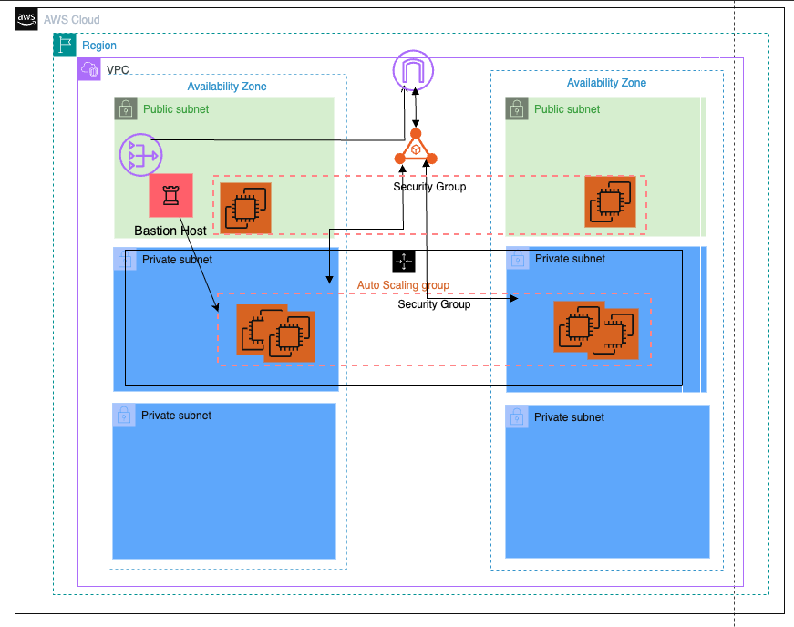

# Coalfire Takehome

## Solution Overview

## Deployment Instructions

## Design decisions and assumptions
- I started with the AWS VPC terraform module because that was something I had already been looking at the other day for a different project and had some familiarity with it.
- I also referenced three-tier web architecture to get an idea of how the infrastructure looks and began to map out a similiar diagram (see top of readme).

## References to resources used
- [Three-tier web app](https://medium.com/@aaloktrivedi/building-a-3-tier-web-application-architecture-with-aws-eb5981613e30)

## Analysis
Security gaps that exist:
- Instead of using a bastion host, I would consider using AWS Systems Manger in order to avoid opening ports and would allow me to reduce potential attack surfaces and therefore enhancing security.

- I'd also consider a WAF of some kind in front of the ALB as I think this could protect the service from potential vulnerabilities.

- I would want to deploy two NAT gateways. One in each public subnet in each AZ. This would maintain high availability but at a cost since Nat Gateways can be expensive.

## Improvement plan with priorities

